# The Boathouse Restaurant

## Introduction

As part of my Diploma  in full stack software development with Code Institute I am required to complete 5 mile stone projects. For my first milestone project, I have created a website for a mock-up website for a restaurant based in Garryvoe, Co. Cork, Ireland for educational purposes.

Please click [HERE](https://andrewmcm98.github.io/The-Boathouse-Restaurant/) to view my website.

I have focused on responsiveness across all devices for design.

## Who is this website for?

This a website providing detail and information for a mock-up restaurant based in Garryvoe, Co. Cork, Ireland. This website has been created to offer customers additional detail about the opening hours, menu, prices, location and general about information for the company to give a customer insight into the products on offer, and who we are.
Additionally, I have included a call to action in providing a section on each page on how to find the restaurant with engaging contact & booking forms to promote customer engagement with the website.
This is a perfect method for restaurants to show case their restaurant, and products whilst engaging with the customer to provide the customer with plentiful information to come dine here.

## The Owner

The owner of this website is me, Andrew McMahon, the developer as this is based on a mock-up restaurant for education purposes to demonstrate my competence in this project.
However, this website can be easily adapted to many other restaurants and is designed to show case the restaurant to attract customers and actively engage with the customer through contact and booking forms, making it easy for the customer to find us.

## What does it do?

This a website providing detail and information for a mockup restaurant based in Garryvoe, Co. Cork, Ireland. This website has been created to offer customers additional detail about the opening hours, menu, prices, location and about information for the company to give a customer insight into the products on offer, and who we are.

## User Experience

### User Stories

#### From the customers perspective

* As a user I want to be able to navigate easily and clearly throughout the website
* As a user I want to get clear information for the restaurant opening times
* As a user I want to find the restaurant easily 
* As a user I want to be able to find the restaurant social media pages easily and clearly
* As a user I want to be able to access and interact with this website on a number of different devices
* As a user I want to see what their menu has to offer with prices clearly displayed so I can make an informed decision
* As a user I want to see images of the restaurant for identification and decision purposes
* As a user I want to be able to contact or make a booking online with ease

#### From the customers fulfilment

* I have designed the website so that the Navigational bar at the top of the screen is clear with easy to navigate links. Additionally I have included a light background and black line to be displayed at all times for the page you are currently on, so that the user will always be aware as to what section of the website they are located on.
* I have included the restaurant opening days/hours at the main page, so that the user is aware of the restaurant operational hours.
* I have incorporated an embedded google map location finder within the footer, on all pages of the restaurant so that the user can find the restaurant with ease. 
* I have included social media links to the relevant social media pages within the footer of the website, which are displayed via the social media logo for easily identifiable links.
* I have ensured that the website is responsive across multiple devices for easy interaction.
* I have included a menu section which is easily navigated to from the navigational menu, of which the menu and prices and clearly displayed for the customer to see what is on offer.
* I have included a gallery which includes images of the food, internal and external view of the restaurant to showcase the view, spacious seating and some of the food on offer to attract a user and improve customer engagement.
* I have included a section for the user to both contact the restaurant with any queries they may have or alternatively make a booking on any given day/time.

## UX 5 Planes

### Strategy Plane
This website was created to provide an online presence to the boathouse restaurant to increase awareness for the restaurant whilst offering an easier efficient method for customers to gain more information about the restaurant and what's on offer, whilst being able to make contact or bookings efficiently through clear logic calls to action in links to the booking page or a google map finder, located on the footer of each page encouraging engagement with the user.

Therefore, following market research of other local restaurants it was important to provide general restaurant information, a menu with pricing, a gallery showcasing the restaurants unique setting by the sea, with clear calls to action for a customer to engage with the website or easily find the restaurant.

### Scope Plane
Important features included within this project are,
* 4 pages
* 2 pages with a specific function to encourage engagement with the user though a contact-us and booking form
* A home page providing opening days/hours with general about information for the user
* A footer containing social media link and a google map finder to encourage engagement across social platforms, whilst making it easy for a user to find the restaurant
* A responsive website so that a user can access and interact with this website across a range of devices
* A gallery section to show case the spacious and picturesque location of the restaurant to attract customers

### Structure Plane
The structure and design of the website was created to contain a specific purpose for each section throughout the website such as,

1. Navigation
- Responsive menu bar across devices
- Easily accessed to the top of each page whilst allowing easy access to each page
- A clear background colour & black strike line to the top of the menu section the user is currently on
2. Home
- Clear bright background colour, with a simple background image and overlay text which is easily read by the user
- A clear section providing information for opening times
- An about us section to provide background information for the restaurant and owner
- A call to action for the user to encourage engagement in booking
3. Menu
- A clear easily found section providing clear concise information for the produce on offer accompanied by a brief description with pricing included
4. Gallery
- This section is show casing the picturesque, spacious and delicious cuisine on offer, which showcases the restaurant whilst appealing to the user
5. Contact Us
- This call to action page is to encourage contact and engagement with the user so that the user can easily and comfortably contact the restaurant with any enquiries or queries they may have
6. Booking
- This is an additional call to action page but with the specific purpose to allow a user to place a booking at any given time/day, offering peace of mind to the user for availability whilst boosting user interaction and experience
7. Footer
- The footer consists of social media links displayed via their logo/icons to encourage engagement with the user and restaurant across their various social media pages to further boost their online presence. Additionally I have included an embedded google map finder, so that a user can quickly and easily locate the restaurant.
Finally, I have included some generic information for the purposes of this website.

### Skeleton Plane
As part of this project I focused design on responsiveness so that this website is responsive and accessible across multiple devices improving both UX & UI.

Please see wireframes below which demonstrate both mobile & desktop view,

### Home
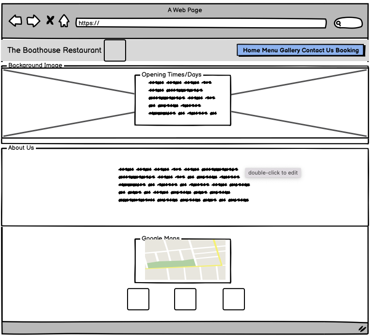
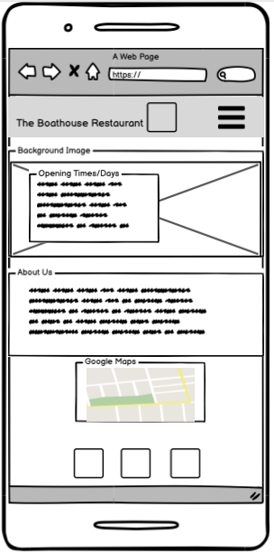

### Menu
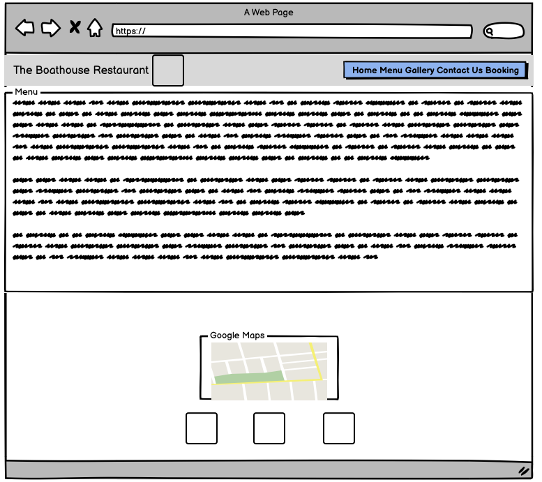
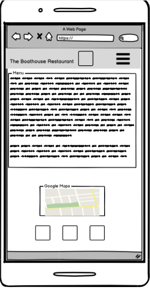

### Gallery
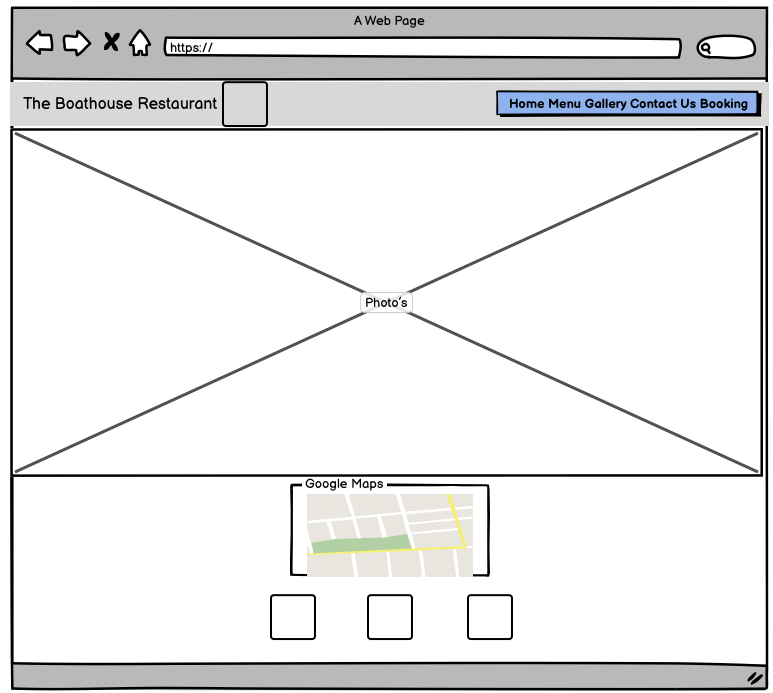
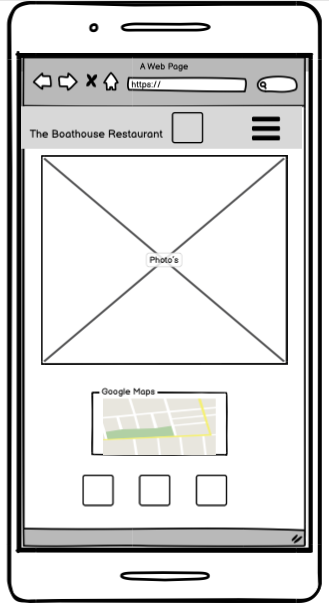

### Contact Us
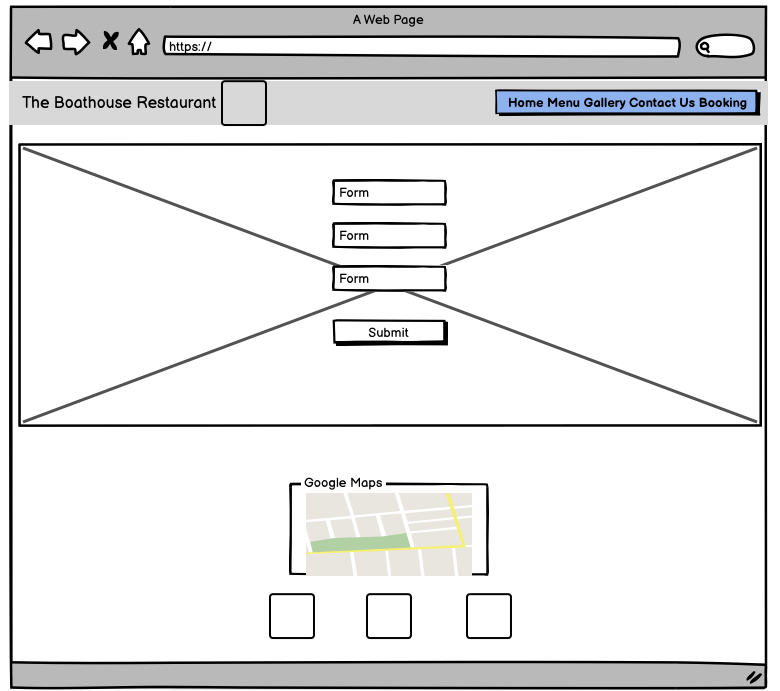
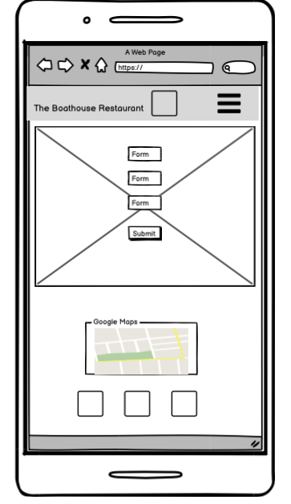

### Booking
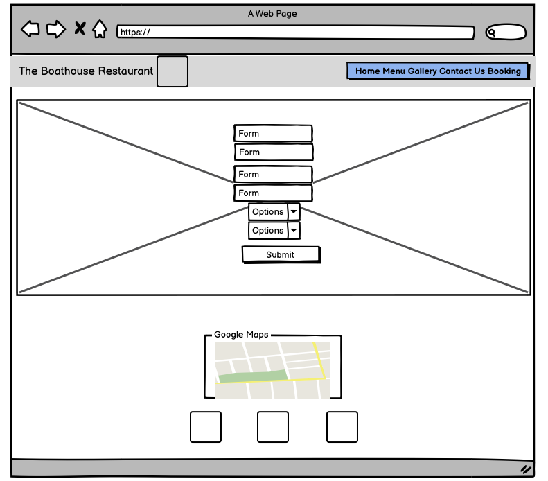
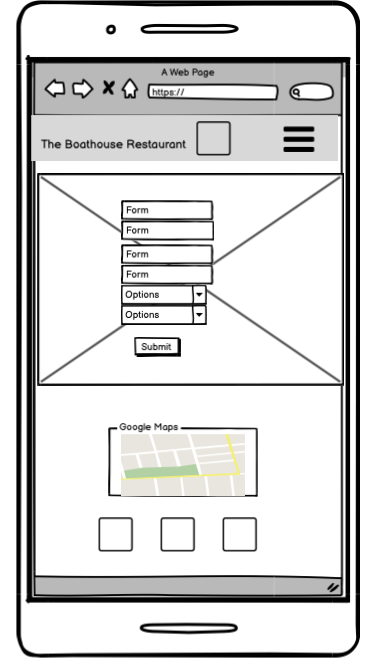

### Surface Plane

#### Colours
1. Background
- Where a background image was not used, I maintained a clean and crisp white/#fff

2. Text
- For text I primarily used 2 colors, which were white/#fff and/or dark grey/#3a3a3a

3. Navigation
- For the menu bar i maintained a white/#fff background section colours, however I utilised an active class so that the page the user is currently on will have a transparent background colour of a baby blue/rgba(153, 197, 223, 0.3), and a dark black border above.

4. Home
- For the image overlay text I used a font colour of white/#fff and a transparent background colour of a light blue/rgba(81, 122, 225, 0.8)
- For the About us section I used a more transparent version of the above light blue/rgba(81, 122, 225, 0.6)

5. Menu
- I have placed an overlay colour of a light grey/rgba(232, 236, 237, 0.8), for text contrast above the background image with a text colour of dark grey/#3a3a3a, for contrast and easy reading.

6. Gallery
- As this section is just for images, the standard default background colour of white/#fff is applied.

7. Contact Us & Booking
- For this section I have allowed a white/#fff colour text and box for the user to input the relevant required information over the background image
- For responsiveness I included a placeholder text which is a transparent black. Additionally, I included a hover effect which when selected will display a light pink/rgba(231, 197, 208, .8) for easy identification of the section the user is currently actioning across all elements including the submit button.

8. Footer
- This section contains a white/#fff background colour with a text colour of dark grey/#3a3a3a, for contrast and easy reading.
- Additionally, the social media logo/icons a coloured black for contrast and easy reading.

#### Fonts
Throughout this website I have utilised Lato, and Roboto which I imported from google fonts with a fallback font of sans-serif, should this not function correctly.

#### Icons
Throughout this website I included free Icons and Logos which I obtained from Font Awesome.

#### Images
The images I used do not display a real physical restaurant, of which I obtained these images under free licence use from, Unsplash.

## Features

### Existing Features
1. Home Page
On first entering the website the user will be met by bright colours, clear text and an easy to follow layout.

The user will also be provided with some key information such as general opening days/hours, an about us section accompanied by a call to action in a anchor link styles to appear as a button, encouraging user engagement to book.
I have styled the link to appear as a responsive button with a hover effect, as we all as background image showcasing the beautiful scenery with a blue theme colour to link with the sea-side.

2. Menu Page

On navigating to the menu page the user will be provided with a clear menu detailing the courses available with the appropriate pricing.
Through reserach online via youtube tutorials and primarily W3 Schools, I was able to create a responsive flex layout.
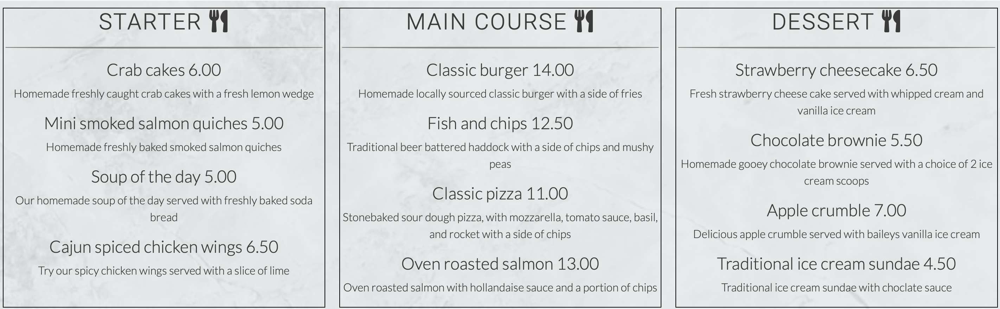
3. Gallery Page

On navigating to the menu page the user will be provided with a gallery providing plentiful photos of the cuisine on offer, restaurant layout internally and externally.
Through research online via YouTube tutorials and primarily W3 Schools, I was able to create a responsive flex layout which will scale the photos up or down according to the device.
For example, in the first image you see the gallery from a smaller device which provides a view of the image's without much of a need to scroll, however in the second image we see larger image's on a desktop which requires a user to scroll.
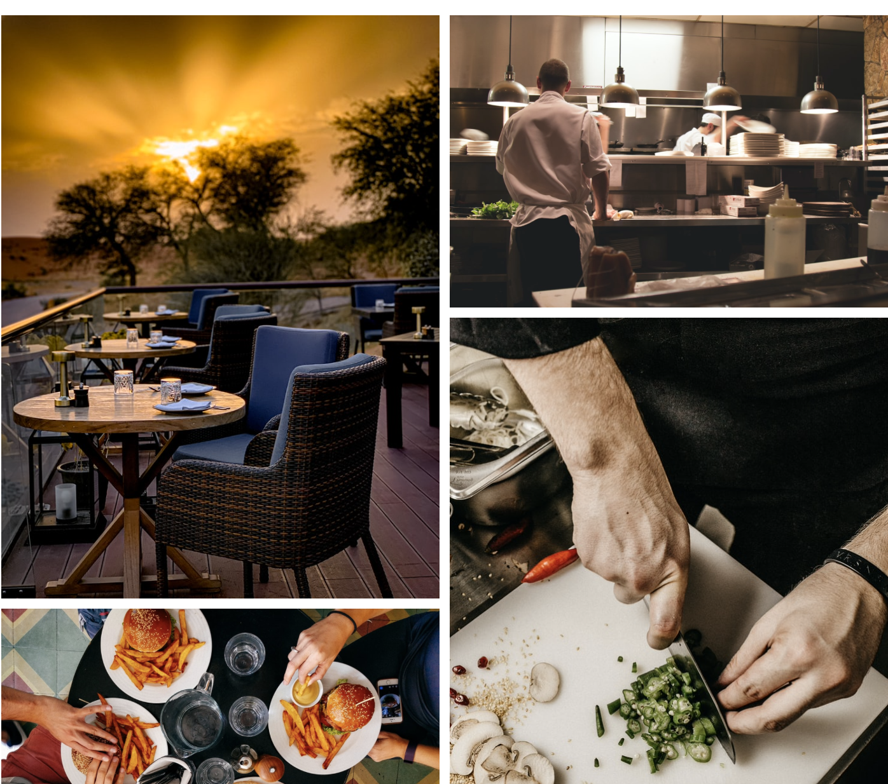

4. Contact Us & Booking page

On navigating to the contact-us or booking page the user will be provided with a form to be completed and can then be submitted to the restaurant on successfully filling out the sections of the form.
Through research online via YouTube tutorials, W3 Schools and code institute lessons, I was able to create a responsive form which can be accessed on multiple devices without distortion.
Additionally, I have styled the form text boxes to appear as a responsive background colour when being typed in with a hover effect as displayed in the images below.
Furthermore, I included placeholder text to assist the user in what each section requires to be submitted.
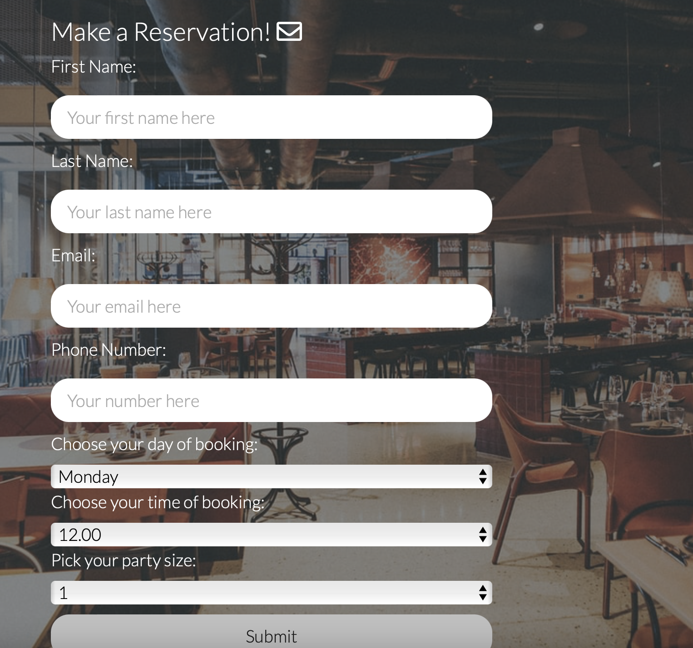
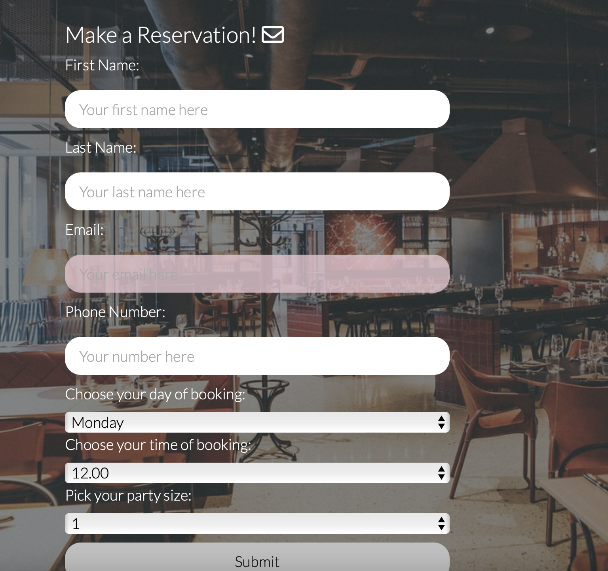
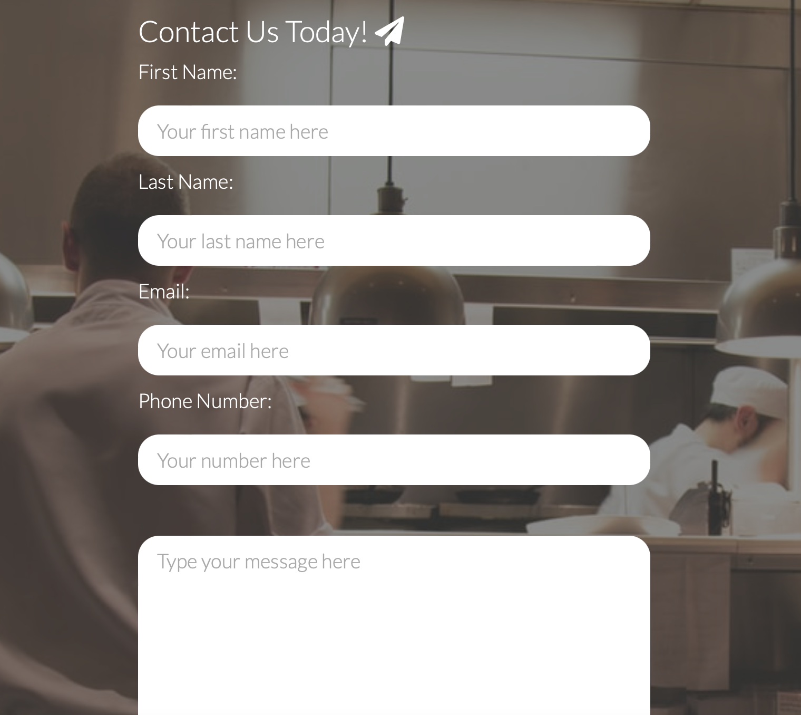
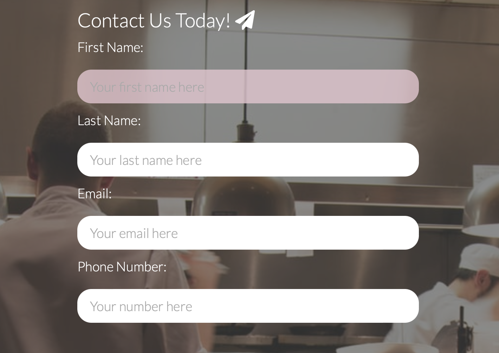
5. Navigation

At the top of each page I have a navigational menu.
On a desktop device, a standard menu will appear with all pages listed at the top of the page.
However, after reviewing online YouTube tutorials, hackathons, online examples from get bootsrap.com, as well as a quick lesson from my mentor Spencer on how to incorporate Bootstrap into my project with a quick demo, I was able to include a functioning hamburger menu script which is responsive across multiple devices thanks to my mentor, and online resources. 
The below images demonstrate the functionality and layout of the menu in both a large or small device.
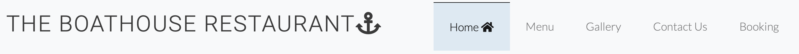
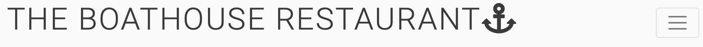
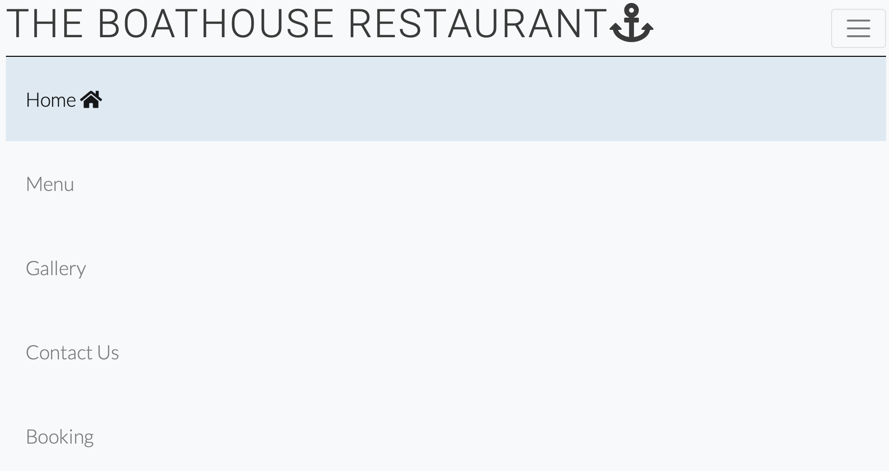
6. Footer

At the bottom of each page I have included a section on how to find us, which encourages user engagement to the relevant social media platforms used by the restaurant boosting their online presence and following.
Additionally, as seen in the below image I have included a google map location finder to make it simple for customers to come dine with us.
Lastly, I have included confirmation that this website is for educational purposes accompanied by my name as the developer.
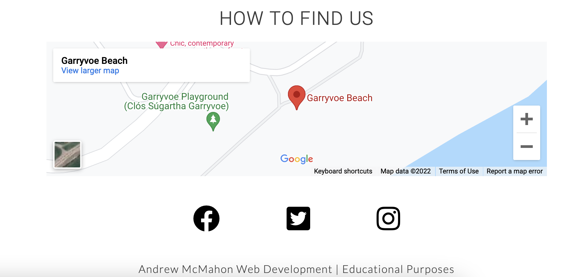
7. Icons

Throughout my project, I have utilised the following icons obtained from font awesome which adds fun and visual aids to customers in identify the sections,
- Anchor Icon, which acts as a company logo
- Home Icon, which is a visual aid for a user to return to the home page
- Social Media Icons, which is a visual aid for a user to view the restaurants social media pages
- Fork & Knife Icons, which is a fun visual aid above the menu section
- Camera Icon, which is a visual aid for a user to know what this section refers to
- Paper Airplane Icon, which is a fun visual icon for a contact page
- Mail Icon, which is a fun visual icon for booking

### Features for future implementation

Through further lessons and projects I would like to add the following future implementations,
 - A functioning contact/booking page which can accept bookings or respond to a contact form being submitted to a restaurant
 - An online food ordering service to incorporate a take away service by the beach, which can accept orders and take payment via the online website securely
 - A cookie pop up banner to request the use of cookies
 - A COVID-19 pop up message to make the customer aware of current COVID regulations or closures

## Resources

- [Unsplash](https://unsplash.com/) for free images
- [Colour Generator](https://coolors.co/) to create different colour palettes
- [Bootstrap](https://getbootstrap.com/) for bootstrap scripts and examples for which I generated the hamburger menu, as further aided in by my mentor Spencer Barriball
- [Code Institute](https://codeinstitute.net/) for course lessons, tutorials, content, walkthrough examples such as coders coffeehouse, love running.
- [Code Institute](https://codeinstitute.net/) Slack Community for assistance throughout each step of the course when I get stuck
- [YouTube Tutorials](https://www.youtube.com/) for thousands of tutorials, supports, examples and lessons, with particular reference to Kevin Powell, Easy Tutorials, Web Dev Simplified and freeCodeCamp.org, for assistance with many aspects from basic HTML/CSS to Bootstrap, and flexbox.
- [W3 Schools](https://www.w3schools.com/) for assistance with everything from HTML/CSS to bootstrap, flexbox, CSS style targeting and responsive design.
- [Am I Responsive](http://ami.responsivedesign.is/) for a clean responsive check and confirmation image as seen in the introduction
- [Font Awesome](https://fontawesome.com/) for icons I utilised
- [Google Fonts](https://fonts.google.com/) for fonts I utilised
- [Mentor Website](https://5pence.net/) for tips and tricks in basic web development, how to write mark up in the readme with example layouts, as well as continued feedback, support, lessons and advice in how to improve my code as well as a quick tutorial in bootstrap not covered in our code institute lesson

## Technologies used

- [HTML5](https://en.wikipedia.org/wiki/HTML) for markup language
- [CSS3](https://en.wikipedia.org/wiki/CSS) for styling
- [Google Fonts](https://fonts.google.com/) for fonts
- [Bootstrap](https://getbootstrap.com/) for bootstrap scripts and examples
- [Font Awesome](https://fontawesome.com/) for icons I utilised
- [Git](https://git-scm.com/) for version control
- [GitHub](https://github.com/) for storing files, documents, assets and deployment of the website as a repository
- Chrome Developer Tools in checking my website responsiveness

## Validator Test

### W3C CSS Validator

On testing my website via direct input on the W3C CSS Validator, no errors were found. However, imported style sheet such as google fonts are not checked and is out of my control.
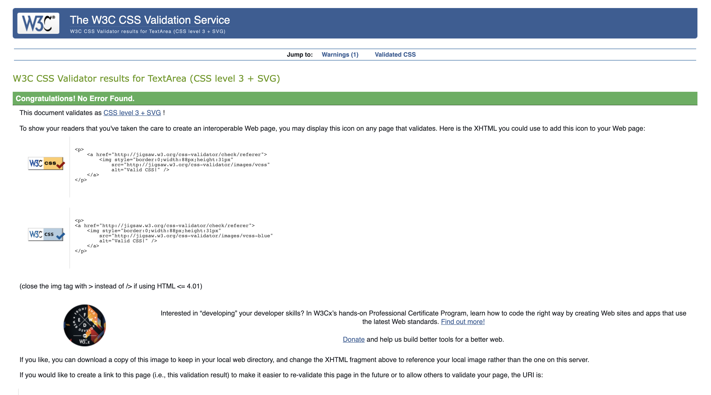

### W3C Markup Validator

On testing my HTML on direct input I note I received errors on the main home page, gallery page and booking page as displayed in the below images.
#### Main Home Page

On review of the HTML validator I note it stated, The element: a must not appear as a descendant or the button element.
Therefore, I removed the button HTML and proceeded to use an anchor link element, of which I styled this to appear as a responsive button, of which this removed this error.
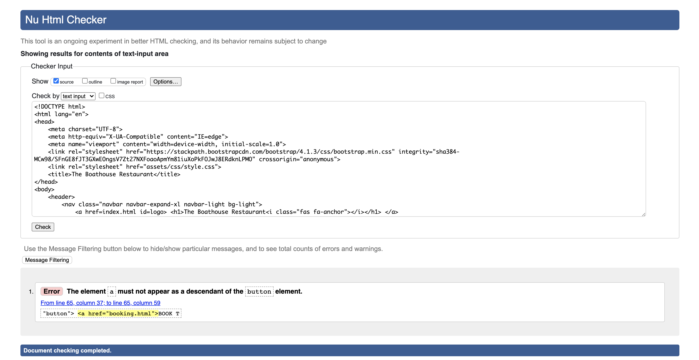
#### Booking Page

On review of the HTML validator I note it stated, 
- The element footer must not appear as a descendant of the header element
- End tag for: body : seen, but there were unclosed elements
- Unclosed element header
Therefore, I proceeded to correctly indent the code layout and close the header and body element, of which this issue was corrected with no further errors.
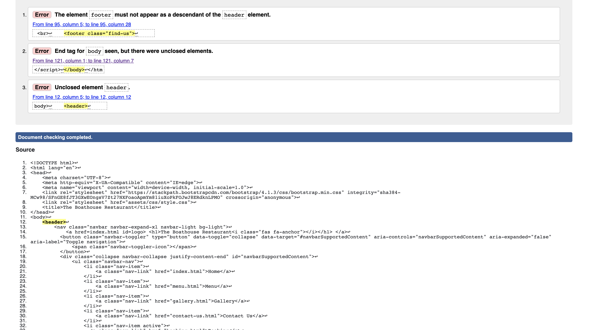
#### Gallery Page

On review of the HTML validator I note it stated,
- Section lacks heading. Consider using h2 - h6 elements to add identifying headings to all sections
However, whilst I note this error/warning suggestion, this page is designed to be a gallery with little to no text of which we have a heading confirming it to be the gallery with alt attributes describing the images for screen reader accessibility.
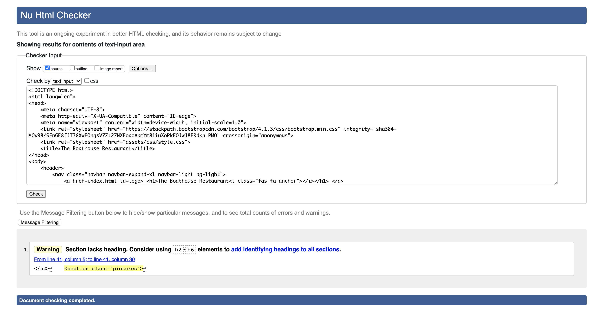
#### Final Test

On final testing of the HTML Validator and direct input with no applicable error or warnings, I completed a URL check which also confirmed there to be no further errors.
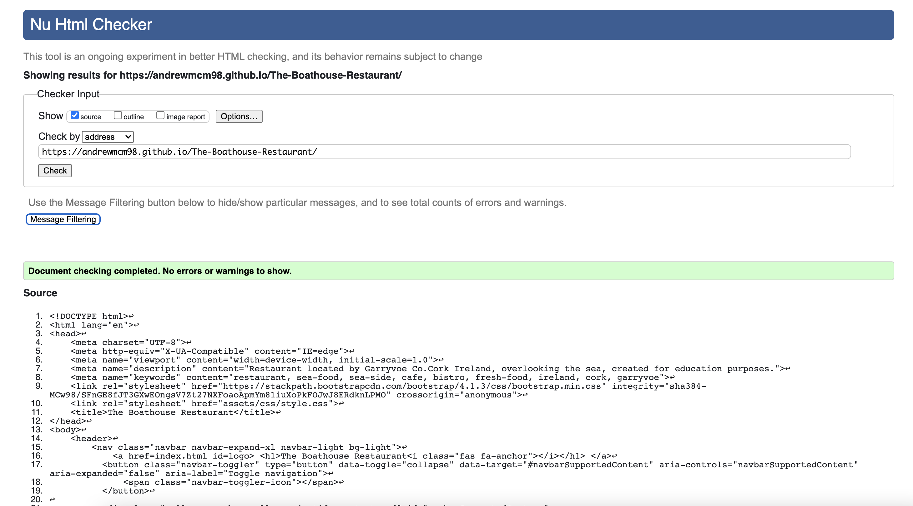

### My own testing including Responsiveness

On completion of the Validators, I carried out my own tests on devices ranging from iPhone 6 to iPhone 12 pro max, iPad Air, MacBook Pro, and a Samsung Galaxy s10, which displayed the website perfectly with no issues on my assessment.

Furthermore, I also used Google chrome developer tools to test responsiveness on multiple devices which all displayed the content correctly.

## Deployment

### Version Control

For my project I used [GitPod](https://gitpod.io/) as a local repository and IDE, whilst I utilised [GitHub](https://github.com/) as a remote repository.

##### The process of version control

The version control process was as follows,
1. I first began with creating a new repository on Github with the compulsory code institute template. I done so by navigating to the code institute template provided as part of the course lessons, and selected "use this template", and proceeded to create a project name.
2. Once a repository was created I clicked, "Gitpod" which created a new workspace for me to begin coding my project.
3. I then proceeded to code, create files, asset folders and upload images for use throughout my project.
4. On completing my coding for the evening I would then have to save the code I created. To do so, I would first ensure I have saved all files, and changes made whilst coding by hitting "cmd S" on my MacBook.
I would then navigate to the bottom of the gitpod workspace and select terminal.
Once in the terminal bash window I would type the following commands,
- git add . - This would select all files within the workspace
- git commit -m "text" - This would enable me to provide a brief description of the work I completed
- git push - This would then push all the code to Github where it is updated & saved

### How to Deploy your project

On completion of a project you will proceed to deploy the website in the following steps,
1. On Github, select your project you wish to deploy 
2. Once on the project you wish to deploy, navigate to Settings
3. Click on setting and scroll to pages
4. Then select pages, and go to the heading Sources
6. Under sources you will see a dropdown box, select this and pick main branch 
7. Once you have selected master, ensure to keep the file as the root directory and save
8. Once saved you will be presented with the websites URL which will become active after a few minutes loading time, of which you can view and share

### How to clone this repository

In order to clone a repository, you should follow the below steps,
1. On Github, select the project you wish to clone
2. Once you have selected the project you wish to clone, navigate to the main page of the repository and click on the large icon, "Code"
3. Once you have clicked on this icon, you will receive a drop down, of which adjacent to the HTTPS address there will be a copy option
4. Click on the copy option and proceed to the gitpod workspace 
5. In your gitpod workspace, proceed to the terminal at the bottom of the screen, and enter the following command with the copies https address as follows, git clone https-etc...
6. Then press enter to create a cloned repository

## Acknowledgements

I would like to thank my mentor Spencer Barriball for his continuous support, advice throughout my project and a lesson/demo in bootstrap which further expands my knowledge and development.

I would also like to thank Code Institute for the in depth lessons, and the Slack Community for feedback and support throughout the course.